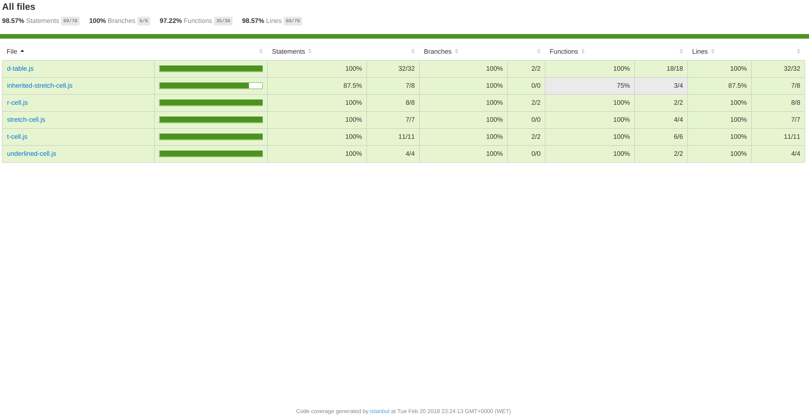

# Practice 2 of PL: OOP
[](https://travis-ci.com/ULL-ESIT-PL-1718/oop-alu0100973914)

In this practice we have designed a new type of Cell for the **Laying out a table** example of the sixth chapter of EloquentJS.

## New kind of cell
The new kind of cell implemented in this practice is the **Stretch Cell**. This type of cell wraps another cell and ensure that the resulting cell has at least the given *width* and *height*, even if the inner cell would naturally be smaller.

## Development

The development of these practice was made in a new branch of this repository called "ecma6". I have developed two classes to represent this kind of cell:
* InheritedStretchCell
* StretchCell

**InheritedStretchCell** extends the TCell class. It must be created with an string as an argument which represents the content of the cell. The second and third parameters passed to the constructor are the width and the height respectively of the new InheritedStretchCell. However, the real width/height of this new type of cell would be the maximum between the value returned by the minWidth()/minHeight() function of the inner TCell of the InheritedStretchCell and the parameter specified when the InheritedStretchCell was created. Example of creation:
```js
var inheritedStretchCell = new InheritedStretchCell("Hello!", 8, 2);
```
**StretchCell** works in the same way of InheritedStretchCell. However, this class encapsulates a reference to
a TCell object, instead of extends TCell class. Therefore,  a TCell object must be given as a parameter to the constructor. Example of creation:
```js
var stretchCell = new StretchCell(new TCell("Hi!"), 4, 3);
```

The tests created to check the behaviour of this new type of cell are located in tests/test.js file.

## Continuous integration with TravisCI

To add continuous integration to this practice i activated this repository in travis-ci.com and then, when i did a commit, the tests were executed in **TravisCI**.
[Travis CI repository](https://travis-ci.com/ULL-ESIT-PL-1718/oop-alu0100973914)

## Istanbul coverage

To check the coverage of the code developed during this practice, I executed the gulp task **cover** which invokes nyc (Istanbul command line interface):
```bash
gulp cover
```

Then the coverage folder was created with the results of the operation in some HTML files, and i was able to serve the results of the analysis executing the next commands:
```bash
npm i node-static -g
static -p 8080 -a 10.6.129.67
```
Visiting the 10.6.129.67:8080/coverage direction using a browser i could see the results:

[See](https://ull-esit-pl-1718.github.io/oop-alu0100973914/)

## Modification
The modification was develop in a new branch of this repo: **modification**
